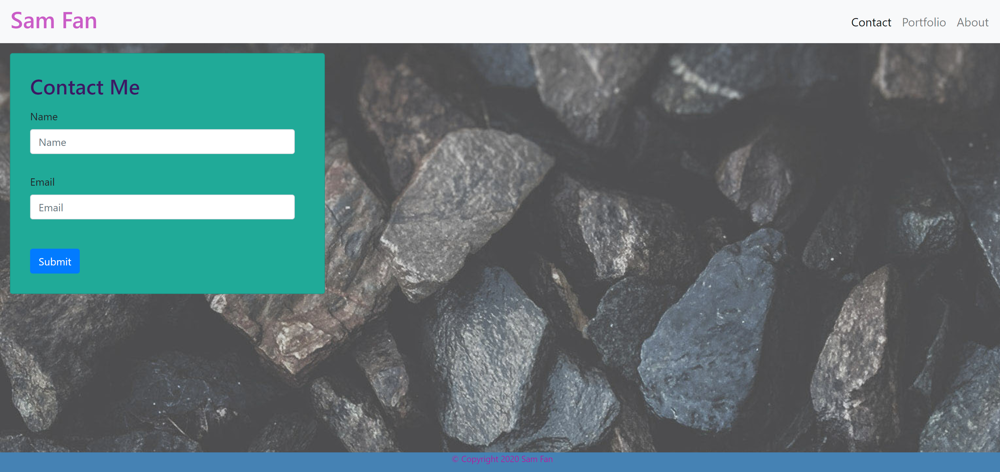

# 02-Homework-Responsive
Homework #2 - Responsive Portfolio

## Overview ##

Homework #2 is comprised of 3 pages, each accessed through functional links on the navbar.
Web pages are responsive to allow for a usable experience on mobile as well as desktop.
Several Bootstrap styles have also been implemented.
Semantic HTML is utilized throughout.

[Link to Homework 02](https://samfan808.github.io/02-Homework-Responsive/)

